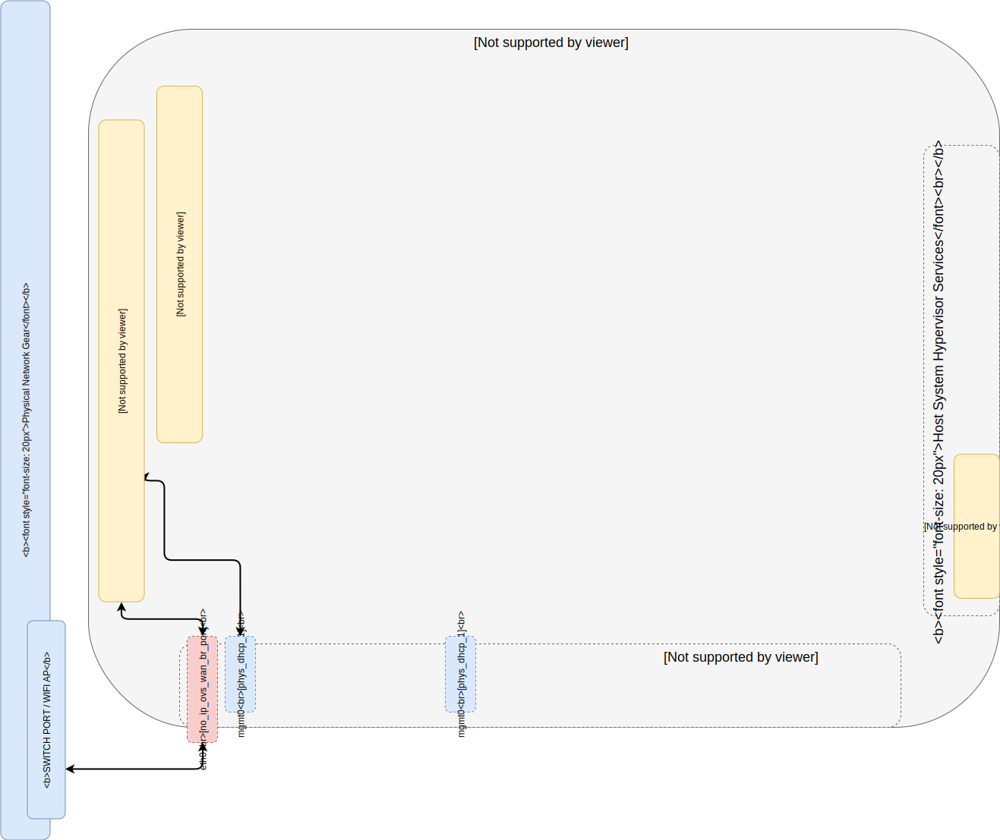
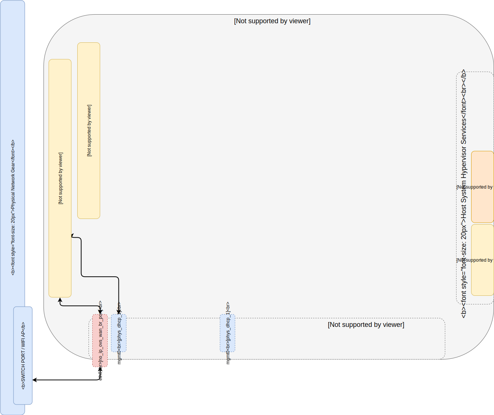
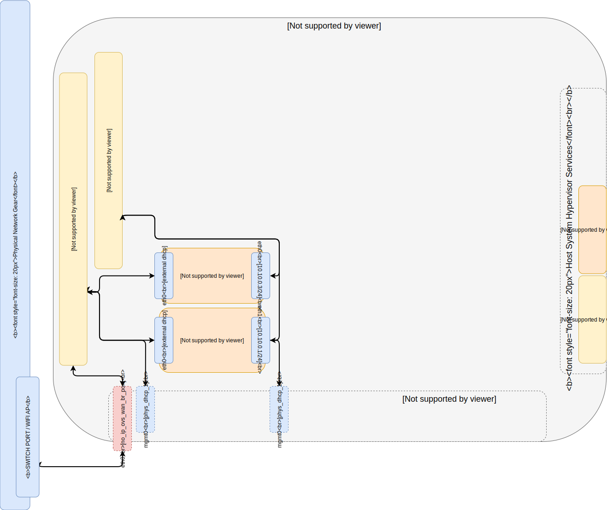
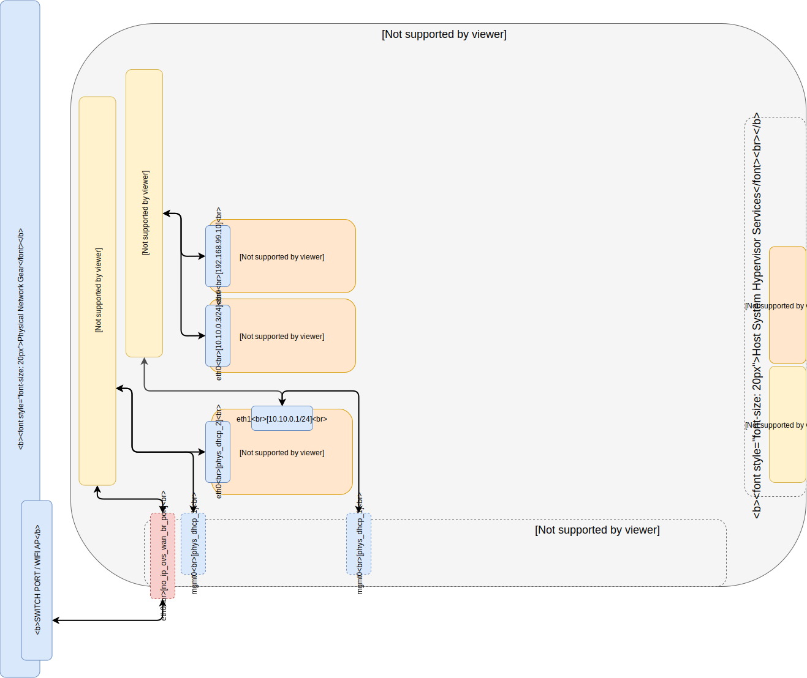
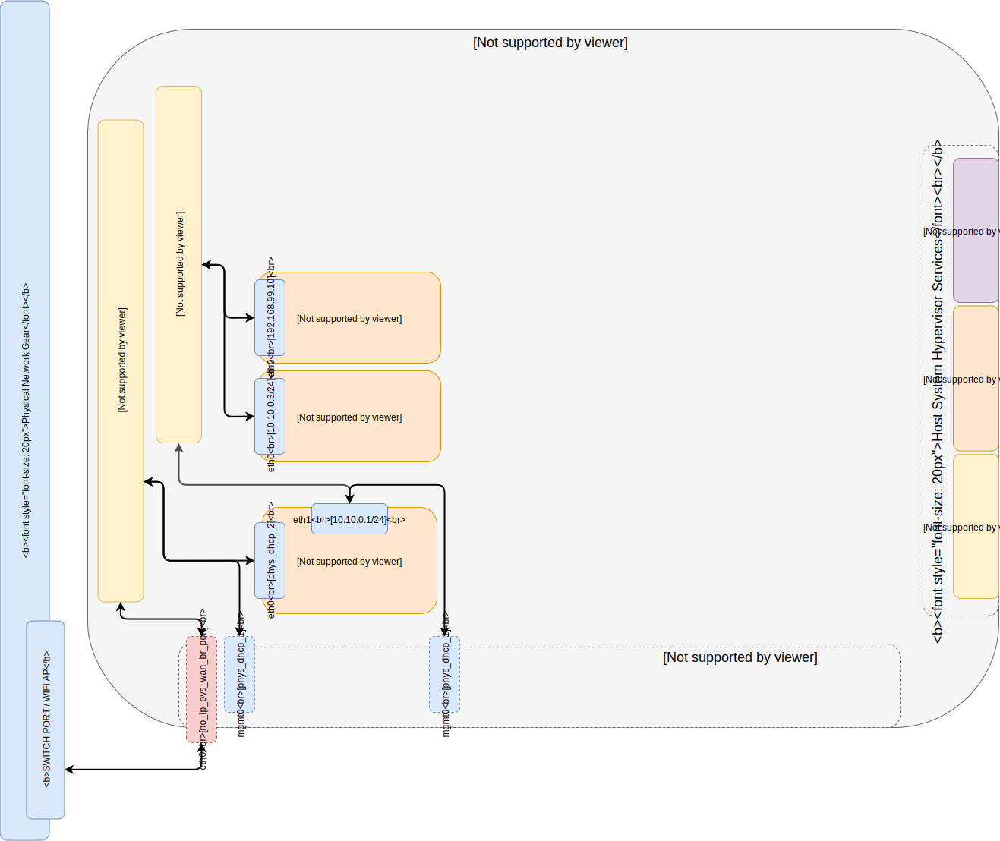
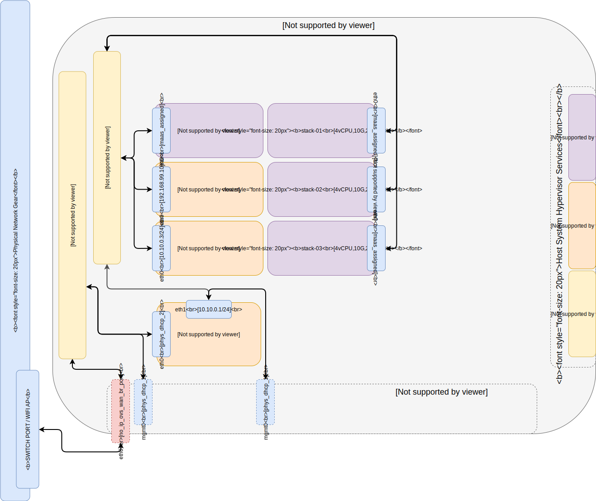
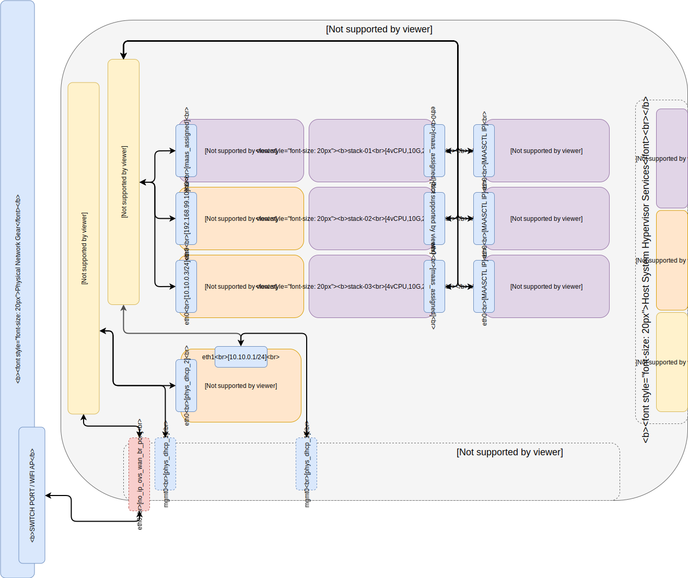

# Index:
-------
## [Part 00 Host System Prep]
-------
## [Part 01 Single Port Host OVS Network Config]

-------
## [Part 02 LXD On Open vSwitch Networks]

-------
## [Part 03 Build CloudCTL LXD Bastion]

-------
## [Part 04 LXD Network Gateway]

-------
## [Part 05 MAAS Region And Rack Controller]

-------
## [Part 06 Install Libvirt/KVM on OVS Networks]

-------
## [Part 07 MAAS Libvirt POD Provider]

-------
## [Part 08 Juju MAAS Cloud Provider]
-------
## [Part 09 Build OpenStack Cloud]

-------
## [Part 10 Build Kubernetes Cloud]

-------
<!-- Markdown link & img dfn's -->
[Part 00 Host System Prep]: ../00_Host_System_Prep
[Part 01 Single Port Host OVS Network Config]: ../01_Single_Port_Host_OpenVSwitch_Config
[Part 02 LXD On Open vSwitch Networks]: ../02_LXD_On_OVS
[Part 03 Build CloudCTL LXD Bastion]: ../03_Cloud_Controller_Bastion
[Part 04 LXD Network Gateway]: ../04_LXD_Network_Gateway
[Part 05 MAAS Region And Rack Controller]: ../05_MAAS_Region_And_Rack_Controller
[Part 06 Install Libvirt/KVM on OVS Networks]: ../06_Libvirt_On_Open_vSwitch
[Part 07 MAAS Libvirt POD Provider]: ../07_MAAS_Libvirt_Pod_Provider
[Part 08 Juju MAAS Cloud Provider]: ../08_Juju_MaaS_Cloud_Configuration
[Part 09 Build OpenStack Cloud]: ../09_OpenStack_Cloud
[Part 10 Build Kubernetes Cloud]: ../10_Kubernetes_Cloud
